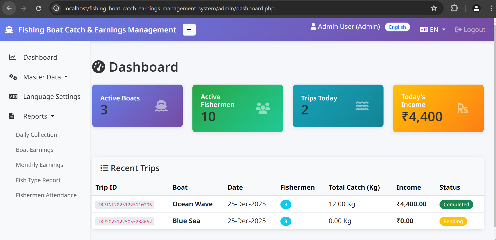
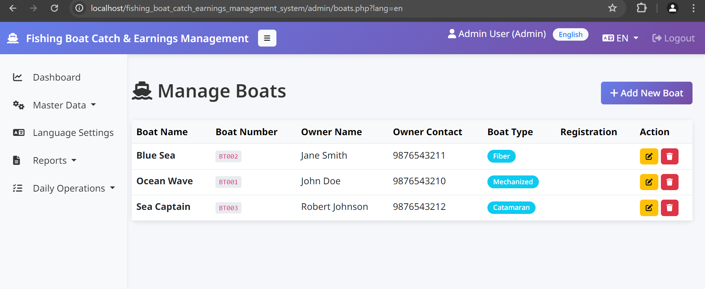
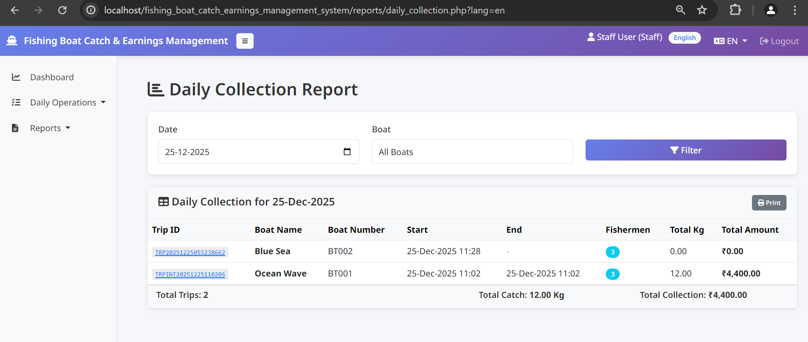
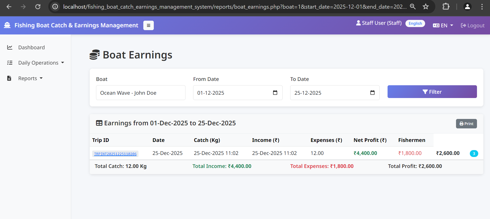
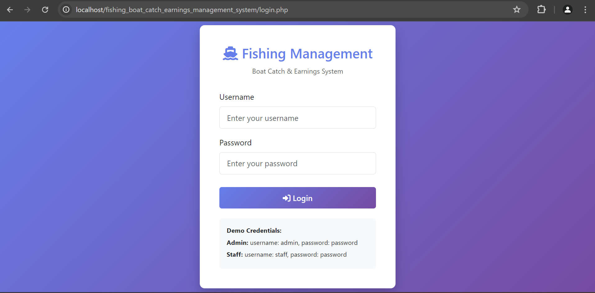

# Fishing Boat Catch & Earnings Management System


A comprehensive web-based management system for boat owners, fishing associations, and small harbors. Record daily fishing trips, track fish catch details, manage fishermen attendance, and calculate boat-wise earnings with improved accuracy and ease.

## 📸 Gallery

| Dashboard |
|:--:|
|  |

| Boats Management | Daily Collection |
|:--:|:--:|
|  |  |

| Boat Earnings | Login |
|:--:|:--:|
|  |  |

---

## 📋 Features

### 1. **User Roles**
- **Admin**: Full access to manage boats, fishermen, fish types, users, and view all reports.
- **Staff**: Restricted access for daily data entry (trips, catch, expenses).

### 2. **Master Data Management**
- **Boats**: Manage boat details (Name, Number, Owner, Type, Registration).
- **Fishermen**: Manage crew profiles (Captain/Crew, Contact).
- **Fish Types**: key configuration for catch entry (Fish Name, Rate/Kg).

### 3. **Daily Operations**
- **Trip Management**: Create and track fishing trips.
- **Fishermen Assignment**: Assign crew members to specific trips.
- **Catch Entry**: Record daily catch by fish type with auto-calculation.
- **Expenses**: Track operational costs (Fuel, Ice, Food, etc.).

### 4. **Reports & Analytics**
- 📊 **Daily Collection**: View daily catch and revenue summaries.
- 💰 **Boat Earnings**: Detailed P&L report for each boat (Income vs Expenses).
- 📅 **Monthly Report**: aggregated performance view.
- 🎣 **Fish Type Report**: Analysis of catch by species.

---

## 🚀 Installation & Setup

### Prerequisites
- **Web Server**: Apache (XAMPP/WAMP recommended)
- **PHP**: Version 7.4 or higher
- **MySQL/MariaDB**: Version 5.7+

### Step-by-Step Guide

#### 1. Get the Code
Clone this repository to your web server's root directory (e.g., `htdocs`):
```bash
git clone https://github.com/jeyarammca/fishing_boat_catch_earnings_management_system.git
```

#### 2. Database Setup
1.  Open **phpMyAdmin** (`http://localhost/phpmyadmin`).
2.  Create a new database named `fishing_management`.
    *   Collation: `utf8mb4_general_ci`
3.  Import the schema:
    *   Select the `fishing_management` database.
    *   Go to the **Import** tab.
    *   Choose the `database.sql` file from the project root.
    *   Click **Go**.

#### 3. Configuration
The system comes with a default configuration for local XAMPP setups.
File: `config/config.php`
```php
define('DB_HOST', 'localhost');
define('DB_USER', 'root');
define('DB_PASS', '');
define('DB_NAME', 'fishing_management');
```
*Modify these values if your database credentials differ.*

#### 4. Access the Application
Open your browser and navigate to:
`http://localhost/fishing_boat_catch_earnings_management_system/`

---

## 🔐 Default Credentials

| Role | Username | Password |
|------|----------|----------|
| **Admin** | `admin` | `password` |
| **Staff** | `staff` | `password` |

> ⚠️ **Security Warning**: Change these passwords immediately after logging in!

---

## 📂 Project Structure

```
├── admin/           # Admin modules (Dashboard, Master Data)
├── staff/           # Staff modules (Trips, Catch, Expenses)
├── reports/         # Analytics and Reports
├── includes/        # Header, Footer, DB connection
├── assets/          # CSS, JS, Images
├── lang/            # Localization files (En, Ta, etc.)
├── database.sql     # Database Schema
└── config/          # Configuration files
```

## 🌐 Localization
The system supports multiple languages. Currently included:
- English
- Tamil (தமிழ்)
- Malayalam
- Kannada
- Hindi

---

## 📄 License
This project is open-source and available for educational and commercial use.

